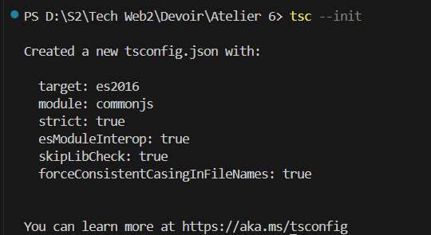

# Atelier 6 : Programmation Orientée Objet en TypeScript

## Introduction
Avant de commencer,il faut connaître les points forts du TypeScript(ses différemces par rapport au JavaScript), à savoir:

- C'est un type statique.
- Des classes avec la visibilité(private,protected,public)
- Généricité
- Namespace

L'objectif principal de ce travail pratique est de maîtriser les concepts fondamentaux de la POO en TypeScript, notamment :

- Les classes et les objets
- L'héritage et le polymorphisme
- Les interfaces et les types
- Les modificateurs d'accès
- Les méthodes et les propriétés statiques

## Contenu du dépôt

Ce dépôt est structuré comme suit :

- `Exercice1/` : Contient les fichiers relatifs au premier exercice.
- `Exercice2/` : Contient les fichiers relatifs au deuxième exercice.
- `Images/` : Contient les captures d'écrans des vérifications,l'installation des outils nécessaires,les compilations et les exécutions du programme.
- `LICENSE` : Le fichier de licence
- `README.md` : Le présent fichier décrivant le travail pratique.

## Prérequis

Avant de commencer, assurez-vous d'avoir installé les éléments suivants :

- [Node.js](https://nodejs.org/) (version 14 ou supérieure)
- [npm](https://www.npmjs.com/) (généralement inclus avec Node.js)
  

- [TypeScript](https://www.typescriptlang.org/)
  

Pour initialiser,on utilise cette commande:

##  Exercice 1 - Classe `Point` et calcul de distance

Dans cet exercice, on s'intéresse à un **point dans un plan cartésien** à l’aide d’une classe `Point` avec deux coordonnées privées : `abs` (abscisse) et `ord` (ordonnée).  
Le but est de :

- Créer un constructeur avec paramètres
- Définir des **getters** et **setters**
- Implémenter une méthode `calculerDistance(p: Point)` qui calcule la distance entre deux points en utilisant une formule mathématique indiquée dans le sujet.
### Résultat

---

##  Exercice 2 - Gestion de personnes et adresses
Cet exercice introduit trois classes liées :

1. **`Adresse`**  
   - Attributs : `rue`, `ville`, `codePostal` (tous privés)  
   - Avec getters, setters et constructeur

2. **`Personne`**  
   - Attributs : `nom`, `sexe` (M ou F), et un tableau d’objets `Adresse`  
   - Avec getters, setters et constructeur

3. **`ListePersonnes`**  
   - Attribut `personnes` (tableau de `Personne`)  
   - Méthodes :
     - `findByNom(s: string)` → retourne la première personne avec ce nom, ou `null`
     - `findByCodePostal(cp: string)` → retourne `true` si une personne possède une adresse avec ce code postal
     - `countPersonneVille(ville: string)` → retourne le nombre de personnes vivant dans une ville donnée

Aussi,dans `main.ts`,on peut tester ce programme.

### Résultat

---

## Conclusion
Grâce à ces deux exercices, j'ai pu manipuler des classes TypeScript de manière concrète, en mettant en œuvre les notions de constructeurs, encapsulation, composition, et recherche dans des tableaux d’objets. Ce sont des bases essentielles pour construire des applications bien structurées et évolutives en TypeScript.
